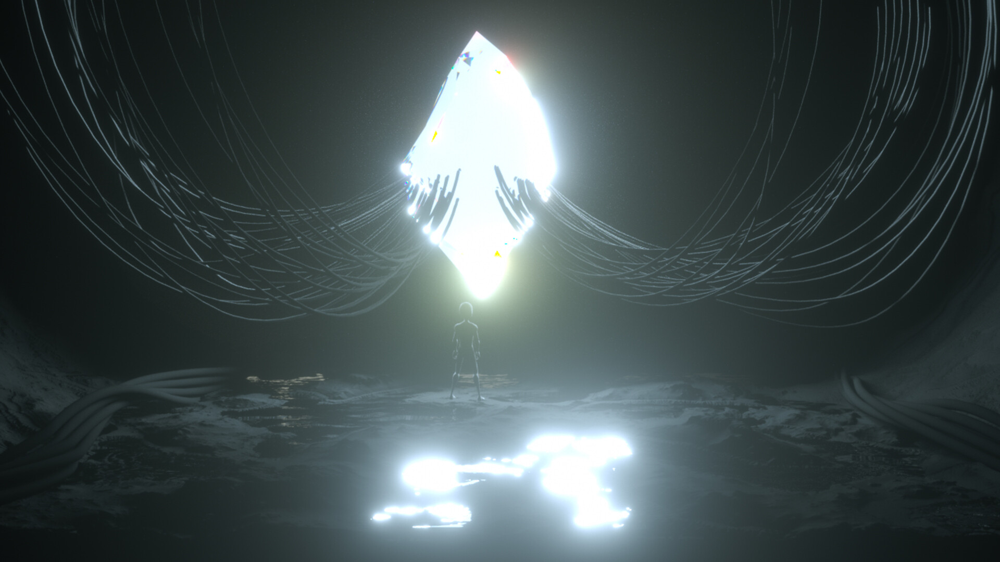
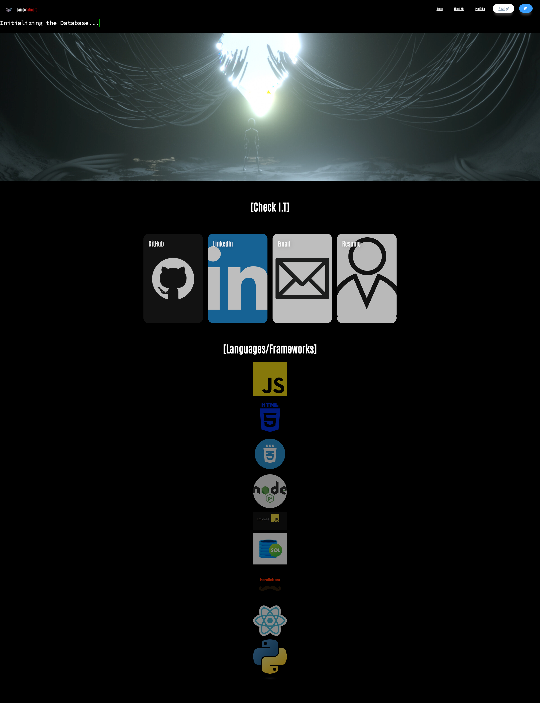
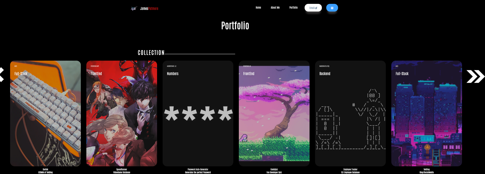
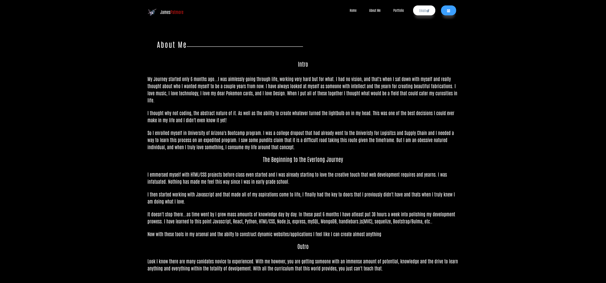

# Hi! I'm James :wave:

I am a Univeristy of Arizona Bootcamp graduate :rocket:
I have mastered many skills in my time within the program and I cannot wait to show you :rocket:

Use the deployment link [here]() to check out the Portfolio where you can learn all about me!! 

You will find a link to my...
Github
LinkedIn
Email
Resume

## Languages ##

## Inspiration ##

I have always loved futuristic asthetics and modern applications. So what better way to make my portfolio something that resembled that :magic_wand:

## Links ##

deployment link: [here](https://jamestpatmore.github.io/portfolio/)

## Screenshots ##

Once you have accessed the page it should look like this:

The navagation bar will take you where you please! :dart: 

Portfolio 

About Me 

##### Thank You #####

Appreciate you for your time, look forward to hearing from you 